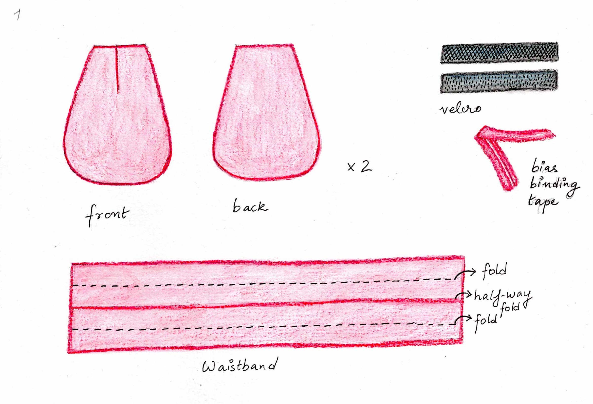
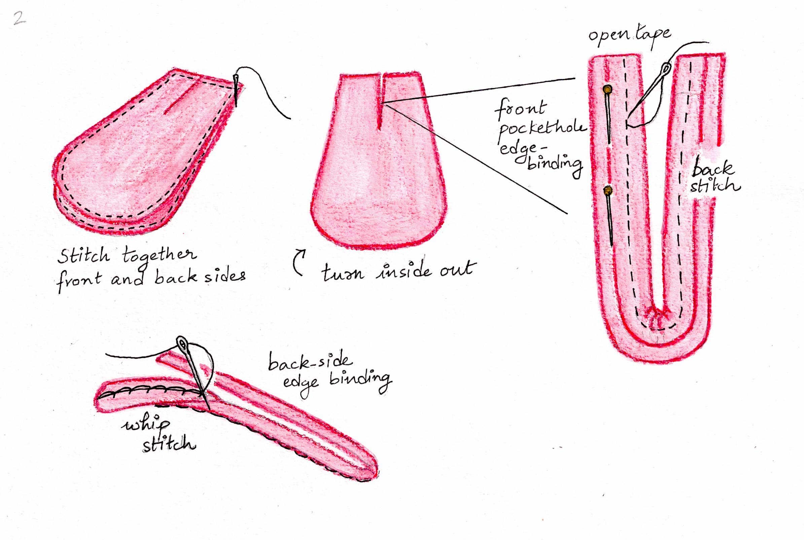
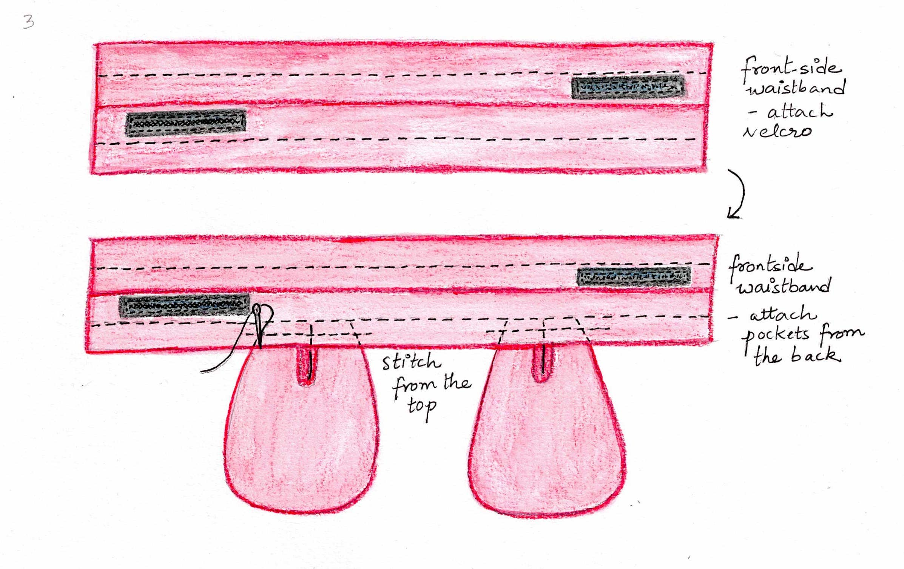
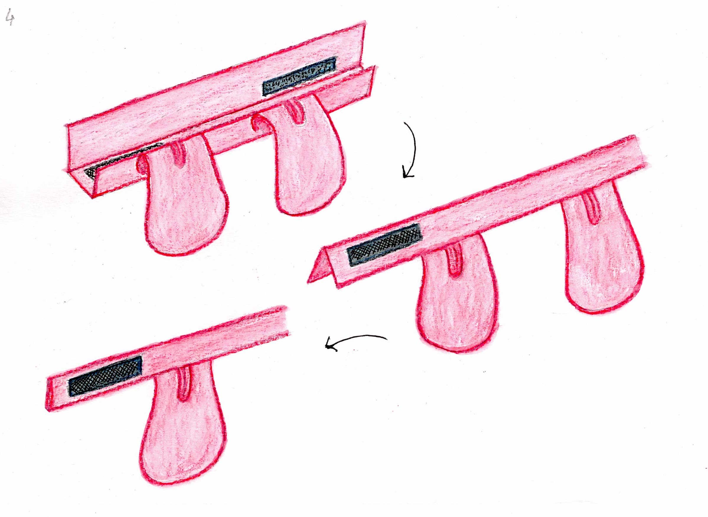
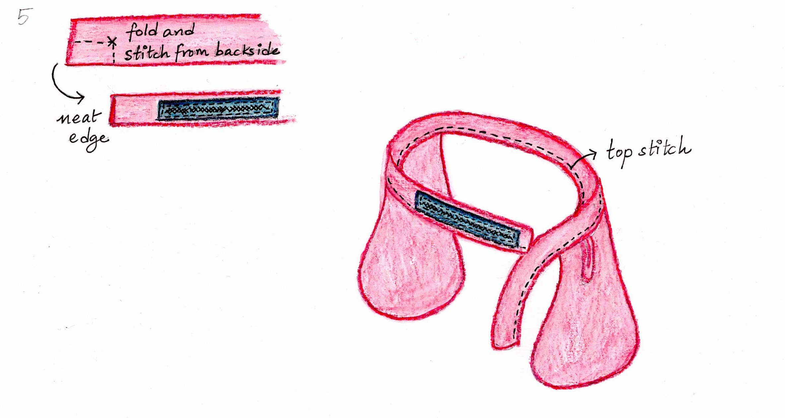

# Victorian-Inspired Pockets
_By Anuradha Reddy_

Correspondence email: anu@duck.com

Website: www.anuradhareddy.com

_Disclaimer: This is my modern take on Victorian pockets. This how-to guide does not provide exact measurements for the construction (because I measured it on myself). You can download the pocket pattern from the project files._  

## Step 1: Assemble the parts

Select your fabric and cut two pockets, each with a front and back piece. Make a slit on the front piece as shown.

Cut out a long stretch of fabric for the waistband, measuring approximately 2.5 times your waist circumference and roughly 20cm in width.

You will also need velcro for the waistband and bias binding tape [or a ribbon] for covering the raw edge around the front pocket hole. 

## Step 2: Sew the pockets

With the right sides facing each other, stitch together the pockets’ front and back sides using a regular line stitch. Leave a gap for the pocket hole. 

Turn the pockets inside out.

Take your bias binding tape and open it flat over the front-facing pocket hole (use pins to hold it in place) and sew along the edge using a back stitch.  

Flip the remaining tape to the back side of the  pocket, fold it in and secure it using an invisible whip stitch. 

## Step 3: Create the waistband 

Take your waistband fabric and fold it quarter-way. 

Sew your velcro hook and loop at the far ends of the waistband, as shown in the drawing. Leave about 7-10cm for finishing (I suggest measuring exactly where you want your velcro to be and 
adjust accordingly).

Place the pockets right-side up below the waistband as shown. Double-check that you are happy with the  placement by pinning the waistband and pockets on yourself. Top stitch over both pockets.

## Step 4: Fold the waistband 

When the waistband is properly folded and laid flat, the velcro’s hook side will be on the front of the waistband and the loop side on the back. 

Note: The waistband will wrap around you so that both sides of the velcro will face each other.  

## Step 5: Finishing!

Open up your waistband and fold it again from the backside. Stitch along an L-shaped path at the ends of the waistband and then turn them inside  out for a crisp front-facing edge.   

Top stitch along the entire waistband from one end to the other catching the pockets again. 

You’re done!       

## Licensing information
This tutorial is licensed under the Creative Commons Zero v1 (CC0 1.0) Universal license.

